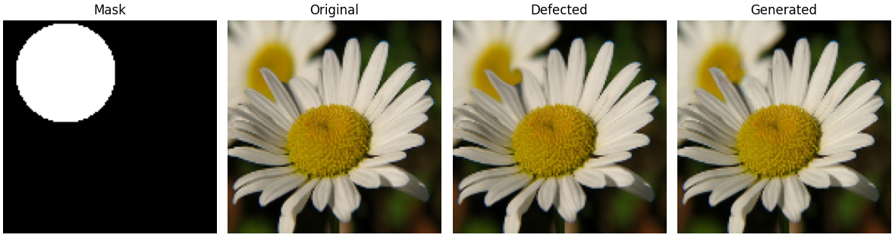
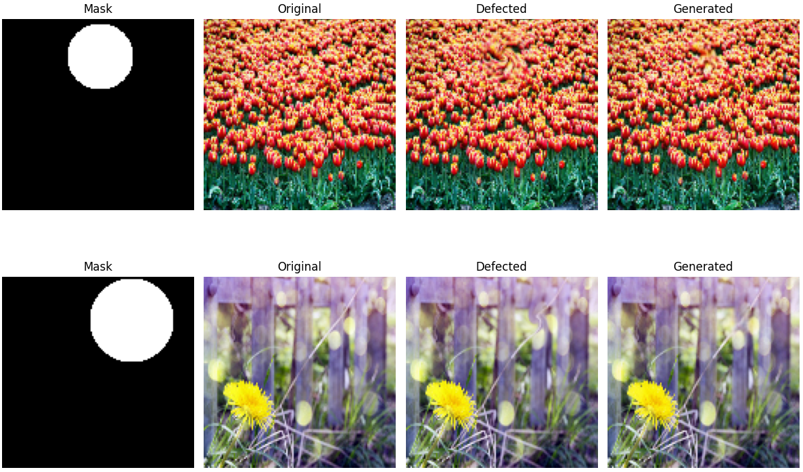

# Swirl_correction_using_Keras
This repository contains the code of the project for the "Deep Learning" course of the master in AI at the University of Bologna. The purpose of this project is to implement a deep learning model using Keras to correct swirl distortions in images. The project consists of a single python notebook that contains the code for data generation (artificial swirl defects on flowers), model definition, training, and testing. Here is an example of a flower image and its corrupted version with swirl distortion:

  

The goal is to build model that takes as input a corrupted image and outputs the corrected version of it.

## Project Constraints
To make it more challenging, the following constraints were established:
- You cannot pass the mask as input to the model.
- The generated image should be evaluated only on the region corresponding to the mask.
- Keep below 4M parameters (total, excluding parameteres of the optimizer).
- Use this [custom evaluation metric](#custom-evaluation-metric).

## Model Architecture
The model I developed is a shallow U-Net-like architecture. I chose the U-Net structure because it is well-suited for image-to-image translation tasks. However, since the swirl distortion affects only a very small region of the image, most of the content can simply be copied as it is, without requiring complex transformations. For this reason, I thought to be unnecessary to compress and reconstruct the entire image, as is typically done in deeper U-Nets, since it would have been a waste of information. The network performs downsampling only down to 32×32, avoiding the loss of useful details and preserving the overall structure of the image. This allows the model to focus on correcting the local distortion while leaving the rest untouched. As a result, the model has a very low number of parameters (around 800,000), making it lighter and faster to train.
To further improve the model's performance, I created an ensemble of 4 identical U-Net models (as I just described) trained independently. The resulting output is obtained by averaging the outputs of the 4 models. This ensemble approach allowed me to further improve model performance according to the [evaluation metric](#custom-evaluation-metric).

## Custom Evaluation Metric
The evaluation metric consists in computing the mean over all the batches in the dataset of the ratio between the MSE of the reconstructed image and the MSE induced by the swirl distortion with respect to the original image. Formally, given M the number of batches in the dataset, the metric is defined as:

$$
\text{Metric} = \frac{1}{M} \sum_{m=1}^{M} 
\frac{\mathrm{MSE}_m(\text{original}, \text{reconstructed})}
{\mathrm{MSE}_m(\text{original}, \text{corrupted})}
$$

Where original is a batch of original images, reconstructed is the output of the model for the batch and corrupted is the corrupted version of the original images for the batch. According to this metric, values above 1 mean that the model is performing worse than doing nothing (i.e., returning the corrupted image as output), while values below 1 indicate that the model is effectively correcting the swirl distortion. The lower the value, the better the performance of the model.

## Custom Loss Function
In order to account for the fact I have no access to the mask at training time, I designed a custom loss function which is a weighted combination of three simpler components: **Patchwise Loss**, **Edge Loss**, and **Pixelwise Loss**.

- **Patchwise Loss**: This loss splits both the original and predicted images into patches, computes the MSE for each patch, and selects only the *k* patches with the highest error. This encourages the network to focus on larger, more distorted regions of the image.

- **Edge Loss**: It extracts edges from both the predicted and target images using Sobel operators, then computes the MSE between them, again focusing on the patches with the most significant edge differencies. This forces the model to better reconstruct edges, especially in the swirled region, which is often just blurred by the model in early training stages.

- **Pixelwise Loss**: This component also uses MSE but only considers a certain percentage of the worst-performing pixels (those with the highest error). This helps the model refine difficult and detailed areas more effectively.

The three losses are combined using weights **alpha**, **beta**, and **gamma**, which are manually adjusted during training to change the model’s focus depending on the training stage.

## Training Strategy
The model was trained in five consecutive stages. In each stage the learning rate and the weights assigned to each component of the loss function are adjusted.

In the **first stage**, a higher learning rate is used, and the entire loss weight is assigned exclusively to the Patchwise Loss, allowing the model to learn a coarse correction of the main distortions.

In **stage 2**, the loss is equally splitted between Patchwise and Edge Loss (50/50), introducing a focus on edge structures.

In **stage 3**, the Pixelwise Loss is added, and the learning rate is slightly decreased to allow the model to better refine fine-grained details.

The **final two stages** serve as refinement: the three losses are assigned fixed weights, and the learning rate is further reduced to stabilize the weights.

## Results
The final ensemble model achieved a score of approximately 0.125 on the test set with a standard deviation across all batches of about 0.011, indicating a significant improvement over the corrupted images. Qualitative evaluation shows that is difficult to distinguish between the original and reconstructed images, demonstrating the effectiveness of the model in correcting swirl distortions.

  

## How to Run the Code
The easiest way to run the code is to use Google Colab. To test the model without performing any training, simply run all the cells in the **Functions Definition** and **Ensemble Model** sections of the notebook, and skip all the training stages included in the **Training Phase** section. This will load the weights I have already trained and made available through gdown. If you want to retrain the model from scratch, simply run all the cells in the notebook.
